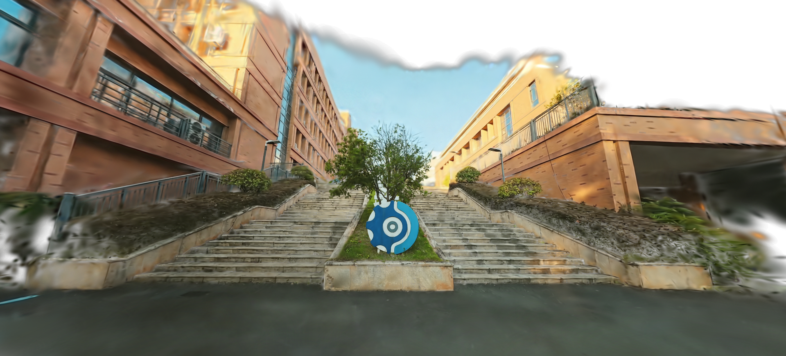

# G--SLAM
Geometrically-Guided 3D Gaussian Splatting SLAM via Robust Loop Validation and Anisotropic Shaping

<p align="center">
  
</p>

<p align="center">
  <strong>Real-world outdoor reconstruction result from G--SLAM.</strong><br>
  The released snapshot highlights the paper's own campus-scale scene reconstructions, including long stair structures, facade boundaries, and reflective glass regions.
</p>

> Pre-acceptance release note:
> This repository is a curated public snapshot of `G--SLAM` prepared during peer review.
> It exposes the core `g2slam` codebase, public-dataset demo/evaluation entrypoints, and documentation needed to understand the method and reproduce the public workflows.
> Some assets tied to ongoing review, including the full private outdoor benchmark package and parts of the internal experiment pipeline, are intentionally not released in this snapshot.

## Overview
`G--SLAM` is a monocular 3D Gaussian Splatting SLAM system built on top of the `HI-SLAM2` baseline and extended with geometry-aware modules for more robust localization and higher-quality reconstruction in sparse-view and visually challenging scenes.

At a high level, the pipeline combines:

1. `Tracking`: dense front-end pose/depth estimation from monocular RGB input.
2. `Loop Closing`: robust loop candidate validation before Sim(3) optimization.
3. `Online Mapping`: incremental 3D Gaussian map construction.
4. `Offline Refinement`: global Gaussian and pose refinement after online tracking.

## Real-World Showcase
The following examples are taken from the real-world scene results prepared for the `G--SLAM` paper rather than the old `HI-SLAM2` teaser material.

<p align="center">
  
</p>

<p align="center">
  
  
</p>

These visualizations emphasize the aspects we care about in the paper:

1. stable reconstruction of building-scale outdoor structure from monocular input;
2. preservation of facade geometry and window boundaries under sparse views; and
3. recoverable local detail around reflective and visually challenging regions.

## What Is Different From HI-SLAM2?
This repository keeps the overall system structure of `HI-SLAM2`, but the public `g2slam` package is organized around the improvements described in the paper:

1. `Robust loop validation`
   Candidates are screened with geometry-aware cues before Sim(3) pose graph optimization to suppress false positives caused by repetitive texture or drift.
2. `Anisotropic shaping`
   The mapping backend uses anisotropic depth regularization to guide Gaussian shaping and better preserve geometric boundaries without relying on pseudo-camera rendering.
3. `Hybrid online-to-offline optimization`
   The system is designed as a hybrid pipeline: fast online tracking/mapping first, followed by an offline global refinement stage.
4. `Key Gaussian Selection`
   The offline stage focuses computation on structurally informative Gaussians to improve refinement efficiency.

## Repository Status
This snapshot is designed to be understandable and practically reusable without over-releasing unpublished assets.

- Released now:
  core `g2slam` package, configs, calibration files, demo entrypoint, public evaluation scripts, TSDF fusion, and reproducibility documentation.
- Deferred until a later release:
  private outdoor benchmark assets, some paper-specific experiment artifacts, and release packaging beyond the public workflows documented here.

Additional details are documented in [docs/release_scope.md](docs/release_scope.md).

## Getting Started

### 1. Clone the repository
```bash
git clone --recursive https://github.com/galahies/G--SLAM.git
cd G--SLAM
```

If you already cloned without submodules:
```bash
git submodule update --init --recursive
```

### 2. Create the environment
```bash
conda env create -f environment.yaml
conda activate g2slam
```

### 3. Compile the CUDA extensions
```bash
python setup.py install
```

### 4. Download Omnidata depth/normal priors
```bash
wget https://zenodo.org/records/10447888/files/omnidata_dpt_normal_v2.ckpt -P pretrained_models
wget https://zenodo.org/records/10447888/files/omnidata_dpt_depth_v2.ckpt -P pretrained_models
```

## Data Preparation

### Replica
```bash
bash scripts/download_replica.sh
python scripts/preprocess_replica.py
```

Prepared data is expected under `data/Replica`.

### ScanNet
Download ScanNet separately and place the extracted `color`, `pose`, and `intrinsic` folders under `data/ScanNet/sceneXXXX_XX`.

Then run:
```bash
python scripts/preprocess_scannet.py
```

### Your Own Monocular Video
Use the preprocessing utility below to extract frames and estimate camera intrinsics with COLMAP:
```bash
python scripts/preprocess_owndata.py PATH_TO_VIDEO PATH_TO_OUTPUT_DIR
```

## Quick Start

### Replica demo
```bash
python demo.py \
  --imagedir data/Replica/room0/colors \
  --calib calib/replica.txt \
  --config config/replica_config.yaml \
  --output outputs/room0
```

Optional visualization flags:

- `--gsvis`: enable Gaussian-map visualization
- `--droidvis`: enable intermediate point/depth visualization
- `--gtdepthdir`: evaluate rendering metrics when ground-truth depth is available

### TSDF mesh extraction
```bash
python tsdf_integrate.py --result outputs/room0 --voxel_size 0.01 --weight 2
```

## Public Evaluation Workflows

### Replica
```bash
python scripts/run_replica.py
```

### ScanNet
```bash
python scripts/run_scannet.py
```

These scripts cover the public benchmark pathways released in this snapshot. Paper experiments involving additional private assets are described in [docs/reproducibility.md](docs/reproducibility.md).

## Recommended Reading Order
If you want to understand the codebase quickly:

1. Entry point: [demo.py](demo.py)
2. Main system class: [g2slam/g2.py](g2slam/g2.py)
3. Tracking frontend: [g2slam/track_frontend.py](g2slam/track_frontend.py)
4. Loop validation / PGBA: [g2slam/pgo_buffer.py](g2slam/pgo_buffer.py)
5. Gaussian backend: [g2slam/gs_backend.py](g2slam/gs_backend.py)

An overview of the directory layout is provided in [docs/project_structure.md](docs/project_structure.md).

## Paper Context
The manuscript evaluates `G--SLAM` on Replica, LLFF, and a self-collected RTK-GPS outdoor driving dataset.

In this pre-acceptance snapshot:

- public workflows are documented for `Replica`, `ScanNet`, and custom monocular videos;
- the private outdoor benchmark assets are not distributed;
- the repository focuses on the released code path needed to understand and run the public-facing pipeline.

## Documentation

- [docs/project_structure.md](docs/project_structure.md): module-to-file mapping and naming conventions
- [docs/release_scope.md](docs/release_scope.md): what is public in this snapshot and what is deferred
- [docs/reproducibility.md](docs/reproducibility.md): public reproduction workflows and limitations

## Acknowledgement
This project builds on ideas and code from `HI-SLAM2`, `DROID-SLAM`, `MonoGS`, `RaDe-GS`, and `3D Gaussian Splatting`.
We thank the original authors for making their work available.

## Citation
If you use this repository in academic work, please cite the G--SLAM manuscript:

```bibtex
@misc{gu2026g2slam,
  title={G²-SLAM: Geometrically-Guided 3D Gaussian Splatting SLAM via Robust Loop Validation and Anisotropic Shaping},
  author={Gu, Xiong and Sun, Mingli and Zhang, Youhui and Bai, Meiping and Kang, Kai},
  year={2026},
  note={Manuscript under review}
}
```
